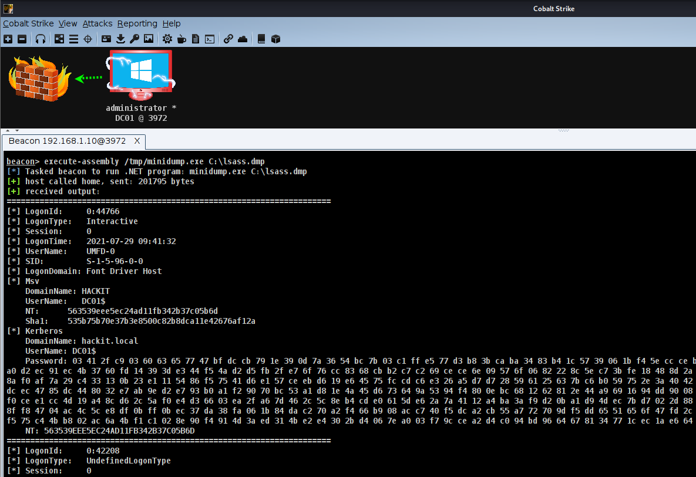

# Minidump

C# implementation of mimikatz/pypykatz minidump functionality to get credentials from LSASS dumps.




### Usage

```
procdump64.exe -ma lsass.exe lsass.dmp
C:\minidump.exe lsass.dmp
```


### Supported Credentials

* Lsa
* Msv
* Kerberos
* WDigest
* SSP
* TsPkg
* Credman
* Dpapi
* CloudAP


### Todo

* LiveSSP
* NT5 Support
* x86 Support


## Acknowledgements

Minidump is based on the following projects and the work by the creators

* [pypykatz](https://github.com/skelsec/pypykatz) by [skelsec](https://twitter.com/SkelSec)
* [mimikatz](https://github.com/gentilkiwi/mimikatz/) by [gentilkiwi](https://twitter.com/gentilkiwi)
* [sharpkatz](https://github.com/b4rtik/SharpKatz) by [b4rtik](https://twitter.com/b4rtik)
